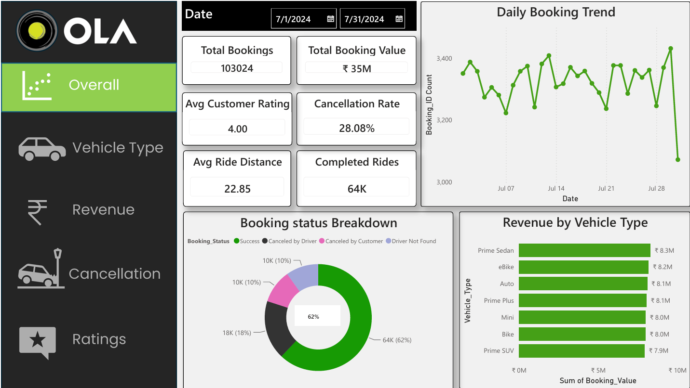
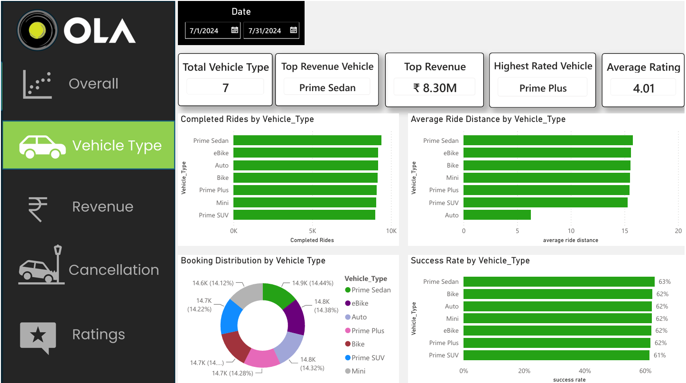
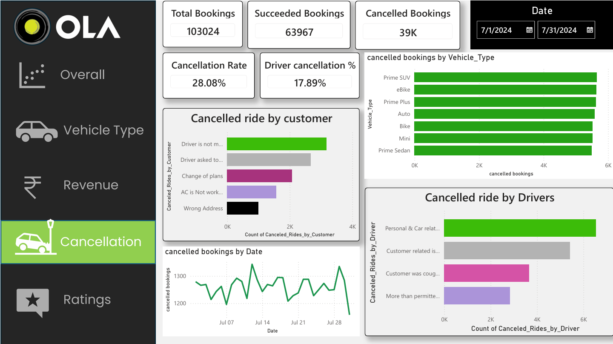
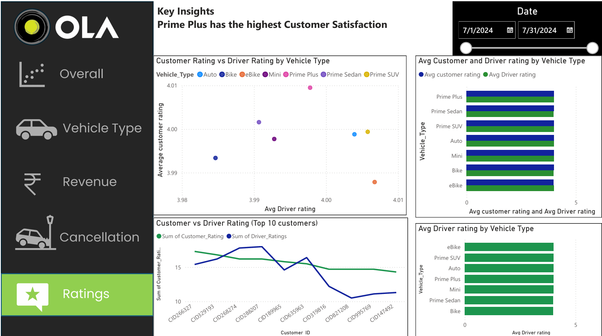

# 🚖 Ola Ride Analytics Dashboard

An end-to-end data analytics project built using SQL, Excel, and Power BI to analyze over *103,000 ride booking records*. The project focuses on ride bookings, revenue, cancellations, vehicle performance, payment methods, and customer & driver ratings.

---

# 📌 Project Overview

This project demonstrates a complete analytics workflow starting from SQL data exploration to building an interactive Power BI dashboard.

The objective was to uncover meaningful business insights that help improve ride operations, customer satisfaction, and revenue performance.

---

# 📊 Dashboard Pages

### 1. Overall Dashboard
- Total Bookings
- Total Booking Value
- Completed Rides
- Cancellation Rate
- Average Ride Distance
- Average Customer Rating
- Daily Booking Trend
- Booking Status Breakdown
- Revenue by Vehicle Type

---

### 2. Vehicle Type Analysis
- Total Vehicle Categories
- Top Revenue Vehicle
- Highest Rated Vehicle
- Average Rating
- Completed Rides by Vehicle
- Average Ride Distance by Vehicle
- Booking Distribution
- Success Rate by Vehicle Type

---

### 3. Revenue Analysis
- Total Revenue
- Average Revenue per Ride
- Highest Booking Value
- Revenue from Successful Rides
- Revenue by Pickup Location
- Revenue by Payment Method
- Daily Revenue Trend
- Top Customers

---

### 4. Cancellation Analysis
- Total Cancelled Bookings
- Driver Cancellation %
- Customer Cancellation Reasons
- Driver Cancellation Reasons
- Cancellation Trend
- Cancelled Bookings by Vehicle Type

---

### 5. Ratings Analysis
- Customer Rating vs Driver Rating
- Average Customer Rating
- Average Driver Rating
- Ratings by Vehicle Type
- Top Rated Vehicle Category
- Top Customer Ratings

---

# 💻 SQL Analysis

The SQL part includes database creation, data validation, and business analysis using views and aggregate queries.

### SQL Business Questions Solved

- Retrieve successful bookings
- Average ride distance by vehicle type
- Total customer cancellations
- Top 5 customers by bookings
- Driver cancellations due to personal/car issues
- Maximum & minimum driver ratings
- Rides paid using UPI
- Average customer rating by vehicle type
- Total successful booking value
- Incomplete rides with reasons

---

# 🛠️ Tech Stack

- PostgreSQL
- SQL
- Excel
- Power BI
- DAX

---

# 📈 Key Insights

- Processed and analyzed *103K+ ride bookings*.
- Generated nearly *₹35 Million* in booking value.
- Overall ride cancellation rate was *28.08%*.
- *Prime Sedan* generated the highest revenue.
- *Prime Plus* received the highest customer satisfaction.
- Cash was the most frequently used payment method.
- Customer and driver cancellation reasons were analyzed separately.
- Vehicle-wise success rate and ride distance revealed operational performance differences.

---

# 📂 Repository Contents

📁 SQL Queries
📁 Power BI Dashboard (.pbix)
📁 Dashboard Screenshots
📄 README.md

---

# 📸 Dashboard Preview

## Overall Dashboard

---

## Vehicle Type Dashboard

---

## Revenue Dashboard

---

## Cancellation Dashboard

---

## Ratings Dashboard

---

# 🚀 How to Use

1. Download the repository.
2. Open the SQL file and execute the queries in PostgreSQL.
3. Open the Power BI (.pbix) dashboard.
4. Refresh the data.
5. Explore the interactive dashboards.

---

# 👩‍💻 Author

*Saziya Khanam*

If you found this project helpful, don't forget to ⭐ the repository.
